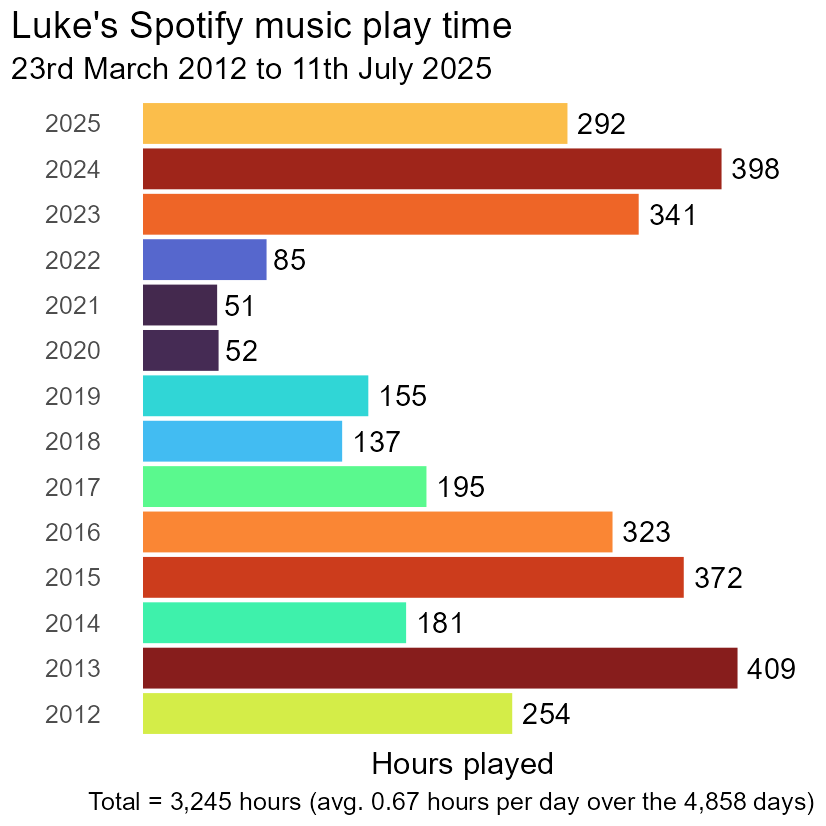
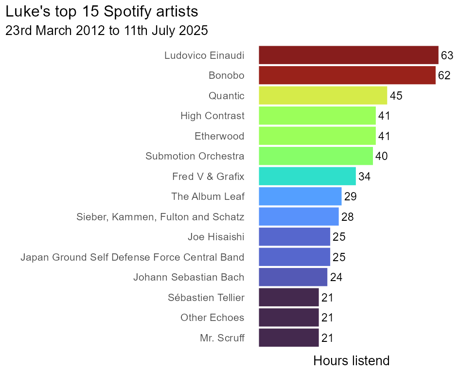
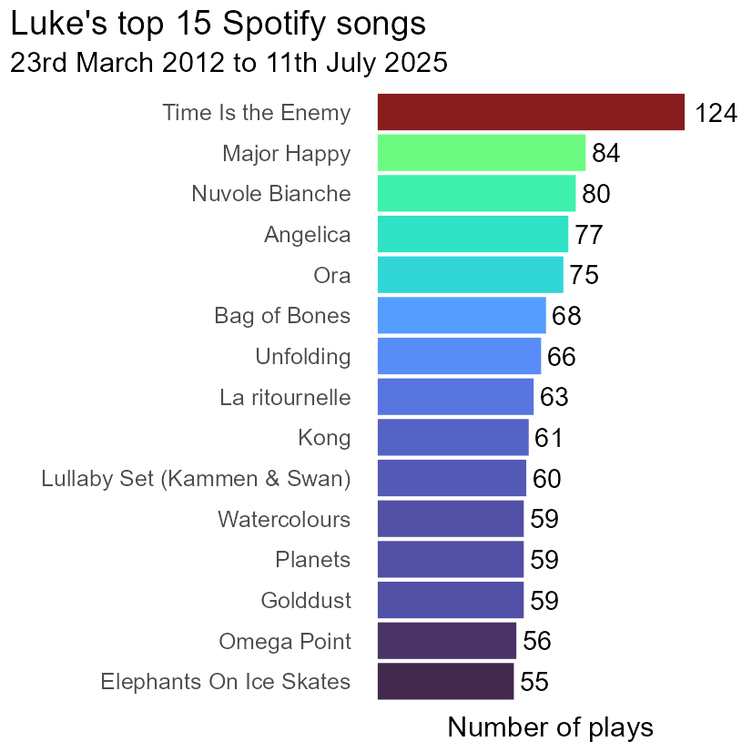

# Luke's Spotify data

Data from 23rd March 2012 to 11th July 2025

## Data

Raw data is in JSON format. 

Derived data is tabular in "tidy" format.

## Scripts

1. Formats the JSON data to tabular format. Creates a few new fields for date, duration, etc.
2. Initial summary analysis of music data (total play time, top songs, top artists).

## Outputs

Plots produced by analysis scripts.

### Total play time per year

### Top 15 artists by total play time

### Top 15 song by number of plays

